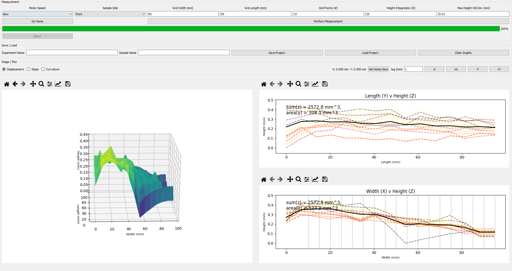

# Glass Displacement

Control and analysis software for the Tandem PV Glass Displacement measurement system.

  
  
  
  

---

<strong>📑 Table of Contents</strong> (click to expand)

- [Overview](#overview)
- [System Architecture](#system-architecture)
- [Features](#features)
- [Recent Improvements](#recent-improvements)
- [GUI Preview](#gui-preview)
- [Quick Start](#quick-start-recommended-anaconda)
- [Launching the Application](#launching-the-application-ipython-recommended)
- [Measurement Workflow](#typical-measurement-workflow)
- [Hardware Requirements](#hardware-requirements)
- [Networking Notes](#networking-notes)
- [Troubleshooting](#troubleshooting)
- [Development Status](#development-status)
- [Authors](#authors)
- [License](#license)

---

## Overview

Glass Displacement provides automated XY stage motion, laser displacement sensing, and real-time visualization through a PyQt5 graphical interface. The software is designed for high-precision surface mapping workflows in research and production environments.

The platform emphasizes **measurement robustness**, **mechanical safety**, and **reproducibility** across different lab setups.

---

## System Architecture

- **Frontend:** PyQt5 graphical interface  
- **Motion Control:** UDP-based XY motor controller  
- **Sensor Interface:** FTDI serial displacement sensor (SICK)  
- **Measurement Engine:** Worker-thread scan pipeline (QThread)  
- **Visualization:** Matplotlib 2D/3D surface plots  
- **Data Output:** CSV export and reload support  

---

## Features

- Automated serpentine grid scanning  
- UDP motor control for XY stage  
- High-precision laser displacement measurements  
- Interactive PyQt5 graphical interface  
- Real-time progress tracking  
- Live stage position display  
- 2D and 3D surface visualization  
- Abort-safe measurement handling  
- Bounded retry with NaN fallback  
- CSV export of measurement data  
- Save/load support for past scans  
- Automatic COM port detection  

---

## Recent Improvements

### Abort-safe measurement pipeline

- Implemented full abort capability across the scan loop  
- Added `AbortError` with `request_abort()` / `clear_abort()` handling  
- Inserted abort checks throughout motion and measurement  
- Integrated abort into the PyQt worker thread  
- Scans now terminate cleanly without freezing the UI  

### Robust handling of unstable measurement points

- Added bounded retry logic with hard limits  
- Prevents infinite rescans at high-variance locations  
- Automatic NaN fallback when convergence fails  
- Skipped points logged and exported to CSV  
- Customizable retry parameters  

### Post-move mechanical stabilization

- Added configurable settle delay after stage motion  
- Implemented throwaway sensor reads before acquisition  
- Reduces vibration-induced noise  
- Improved measurement consistency  
- Tunable parameters for different hardware setups  

### Motor communication reliability

- Thread-safe motor command lock (one command at a time)  
- UDP timeout and retry handling  
- Stale packet flushing before new commands  
- Support for commands without replies  
- Filtering of ACK/noise packets  
- Fixed inverted stage axis behavior  
- Updated position parsing (absolute + conversion)  

### Safer and more flexible stage control

- Rewrote homing logic to prevent overtravel  
- Added boundary safeguards to avoid mechanical crashes  
- Implemented manual jog controls  
- Added **Set Home Here** functionality  
- Supports variable sample sizes  
- Improved live position tracking  

### UI stability and responsiveness

- Measurement now runs in QThread worker  
- UI no longer freezes during scans  
- Prevented overlapping measurement runs  
- Added live stage position updates  
- Added progress bar for scan monitoring  
- Improved input validation and autofill  
- Fixed plot refresh and disappearing image issues  
- Safe thread cleanup on finish/error  

### Sensor connection improvements

- Automatic COM port detection via FTDI VID/PID  
- Eliminates manual port selection on new machines  
- Clean open/close lifecycle for the displacement sensor  
- Improved initialization reliability  

---

## GUI Preview

---

## Quick Start (Recommended: Anaconda)

Create environment and install:

conda create -n glass_disp python=3.10  
conda activate glass_disp  
pip install -e .

---

## Launching the Application (IPython Recommended)

Start IPython:

ipython

Then run:

from Glass_Displacement.Glass_Displacement import GD_UI  
GD_UI()

**Why IPython?**

- Faster iteration during hardware testing  
- Easier debugging  
- Avoids repeated script restarts  
- Better interactive workflow for lab environments  

---

## Typical Measurement Workflow

1. Connect motors and displacement sensor  
2. Launch the GUI  
3. Home the stage (or use **Set Home Here**)  
4. Configure grid width, length, and resolution  
5. Run measurement  
6. Review plots  
7. Save results  

The scan uses a serpentine traversal pattern with stabilization delays between moves.

---

## Hardware Requirements

### XY Stage

- Dual motor screw drive  
- UDP communication  
- Static IP configuration required  

### Displacement Sensor

- FTDI serial interface  
- 921600 baud  
- Automatic port detection supported  

---

## Networking Notes

Motor communication requires the computer and motors to be on the **same subnet**.

- If motor IP is `192.168.0.60`, the PC should be `192.168.0.XX`  
- The last octet must be a different unused address  
- Static IP configuration is typically required  

Important:

- The first three octets must match between PC and motors  
- Socket bind address must be in the same subnet  
- UDP ports must not be blocked by the firewall  

---

## Troubleshooting

### PyQt fails to launch

- Use the Anaconda workflow above  
- Ensure PyQt5 installs inside the same environment  
- Avoid mixing system Python with conda  

### Motors not responding

- Verify PC and motors are on the same subnet  
- Check UDP ports are not blocked  
- Confirm motor controller IP settings  
- Ensure motor IPs match the configured motor list  

### Sensor not detected

- Confirm FTDI device appears in Device Manager  
- Verify COM port permissions  
- Check USB cable and power  
- Try reconnecting the device  

---

## Development Status

**Beta** — active development and internal use.

---

## Authors

- Sean P. Dunfield — Original implementation  
- Jayden — Major modifications, stability improvements, and UI enhancements  

---

## License

MIT License (see LICENSE file)
